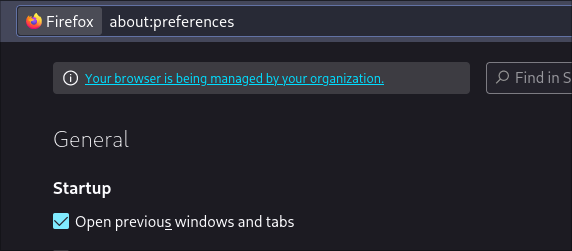

# Firefox + Nix

I am a Firefox user. The reason I started using Firefox was that it pretty much worked out of the box on Wayland since day one. Chromium based browsers taking over the web is also a good reason to start using Firefox now.

The only problem is that it comes filled with a bunch of bloat that I don't really need. Sponsored links and the recommended content on the default home page are all examples of this.

But luckily, Firefox makes it possible to disable these relatively easily, using one or both of the two files - `user.js` and `policies.json`

## user.js
A `user.js` is a file that exists in the profile directory of firefox, `$HOME/.mozilla/firefox/<profile name>`. It contains calls to a function `user_pref(key, value)` where key is any of the firefox settings and value is the value for that setting.

Example:
```js
user_pref("app.shield.optoutstudies.enabled", false);
user_pref("privacy.donottrackheader.enabled", true);
user_pref("privacy.firstparty.isolate", true);
user_pref("privacy.globalprivacycontrol.enabled", true);
```

The profile name is usually a random string followed by `.default`. The easiest way to find this is to go to the `about:profiles` page in firefox and clicking the `Open Directory` button for `Root Directory`. This should open the profiles directory in a file browser.

By default, the `user.js` file does not exist so it needs to be created. Once created, lines like the above can be added to it to change "almost" any settings in firefox.

### What is the key in user.js?
All possible keys can be found in the `about:config` page of firefox. Typing anything into the search bar in this page will start showing all the options that match. The values can be changed from this page and it would change the curresponding firefox setting.
The hard part is finding which options here currespond to which option in firefox settings.

Using inspect element in the firefox settings page, `about:preferences`, use <kbd>Ctrl+Shift+C</kbd> to enable the hover mode and hovering over any thing here should show the curresponding html element in the inspect window.
In the highlighed html element, the `preference` html attribute points to he curresponding option in about config.


In the screenshot, when hovered over the `Always check if Firefox is your default browser` setting, the inspect window highlights the `checkbox` element with the preference `browser.shell.checkDefaultBrowser`. Any change to that preference in `about:config` will reflect in the settings page.


Now, adding a line
```js
user_pref("browser.shell.checkDefaultBrowser", false)
```
to `$HOME/.mozilla/firefox/<profile>/user.js` and restarting firefox will stop Firefox from checking if it's the default browser.

Now a `user.js` with all the settigs that need to be changed can be created and kept around, maybe in a git repo along with all the other dotfiles, and any time Firefox is reinstalled or installed on a new machine, this file can be copied over to the new profiles directory and all these settings can be applied in a single step. No need to go poking around the settings page everytime.

References:
1. [Arkenfox user.js wiki](https://github.com/arkenfox/user.js/wiki/2.1-User.js)

## policies.json
`policies.json` is a more stricter alternative to configuring Firefox. It is a feature meant for Firefox for Enterprise which is meant for an organization can enforce the behavior of Firefox.

This can be used to enable or disable parts of the browser, install extensions automatically, prevent user from changing settings etc.

To use this, created a file called `policies.json` inside a directory called `distribution` in the directory where firefox is intalled. On a Debian machine, this is `/usr/lib/firefox/distribution`. It may vary depending on the OS and installation methods.

The list of available policies are available [here](https://mozilla.github.io/policy-templates). Although there might be some policies that are version specific, most of them should just work. Once the relevant policies are added to `policies.json` and firefox is restarted, going to `about:policies` should list all the active policies. This will also add a `Your browser is being managed by your organization.` message to the top of the settings page.



If there are errors with any of the policies, or if some policy is not supported in with the version of firefox, it will be shown under the `Errors` section in `about:policies` page.


## What does Nix have anything to do with this?
The firefox package provided in nixpkgs supports overrides for policies. `pkgs.firefox.override { extraPolicies = { ... } }` can be used when installing firefox to set any of the supported policies.
The NixOS module for Firefox, `programs.firefox` has [options](https://nixos.org/manual/nixos/unstable/options#opt-programs.firefox.policies) to control these policies. Same is the case with Home Manager. The options `program.firefox.policies` or `programs.firefox.profiles.<name>.settings` can be used to set the policies and user.js configs respectively.
With this, instead of keeping track of 2 files, policies.json and user.js, in some dotfiles repository and remembering to keep them up to date everytime something is changes, it can be tracked along with the rest of the NixOS configuration. Yay!


